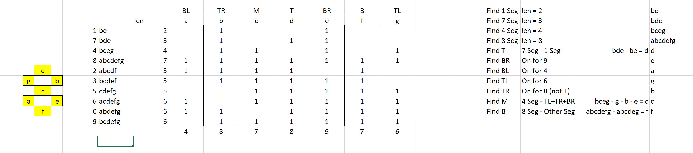

# Advent Of Code 2021

My solutions to the AoC 2021

https://adventofcode.com/2021

## Special Notes

### Day 8 Part 2

This was an interesting one, lets just say I put on Hot Fuzz the movie and started looking into how to break this down.  Finally worked it out when Nicholas Angle... Angel was riding into town on the horse!

I am sure there are better ways to work this out and I am sure there will be a huge number of people with elegant and clean solutions vs my janky code here but you know what it works!

The key was sorting the letters into order and inserting them into a table:



Enabled me to find the other patterns such as the totals which gave me some easy wins.

The guide on the right in the screenshot shows how I got the segment codes.  It is a bit rough and ready but I hope it makes sense to those who have worked on the problem.

```plain
T = Top Segment
TR = Top Right Segment
TL = Top Left Segment
M = Middle Segment
BR = Bottom Right Segment
BL = Bottom Left Segment
B = Bottom Segment
```